# Factory Method 

Factory Method is a creational design pattern that provides an interface for creating objects in a superclass, but allows subclasses to alter the type of objects that will be created.


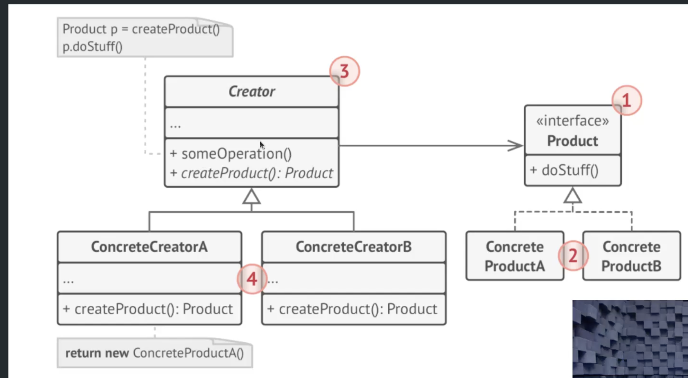


## Applicability

#### Use the Factory Method when you don't know beforehand the exact types and dependencies of the objects your code should work with.   
#### Use the Factory Method when you want to provide users of your library or framework with a way to extend its internal components.   
#### Use the Factory Method when you want to save system resources by reusing existing objects instead of rebuilding them each time.

```php
namespace Src\FactoryMethod;

interface Publisher
{
    public function publish(Message $message);
}
```

```php
namespace Src\FactoryMethod;

abstract class MessagePublisher
{
    public function publish(Message $message)
    {
        $publisher = $this->createPublisher();
        $publisher->publish($message);
    }

    abstract protected function createPublisher(): Publisher;
}
```

```php
namespace Src\FactoryMethod;

class LinkedInPublisherFactory extends MessagePublisher
{
    protected function createPublisher(): Publisher
    {
        return new LinkedInPublisher();
    }
}
```
```php
namespace Src\FactoryMethod;

class LinkedInPublisher implements Publisher
{
    public function publish(Message $message)
    {
        // TODO: Implement publish() method.
    }
}
```
```php
namespace Src\FactoryMethod;

class MessagesController extends Controller
{
    private $publisher;

    /**
     * @param MessagePublisher $publisher
     */
    public function __construct(MessagePublisher $publisher)
    {
        $this->publisher = $publisher;
    }

    public function publishMessage(Request $request)
    {
        $this->publisher->publish(new Message());
    }
}
```

```php
public function register()
{
    $this->app->bind(abstract: MessagePublisher::class, concrete: LinkedInPublisherFactory::class);
}
```

# Abstract Factory

Abstract Factory is a creational design pattern that lets you produce families of related objects without specifying their concrete classes.

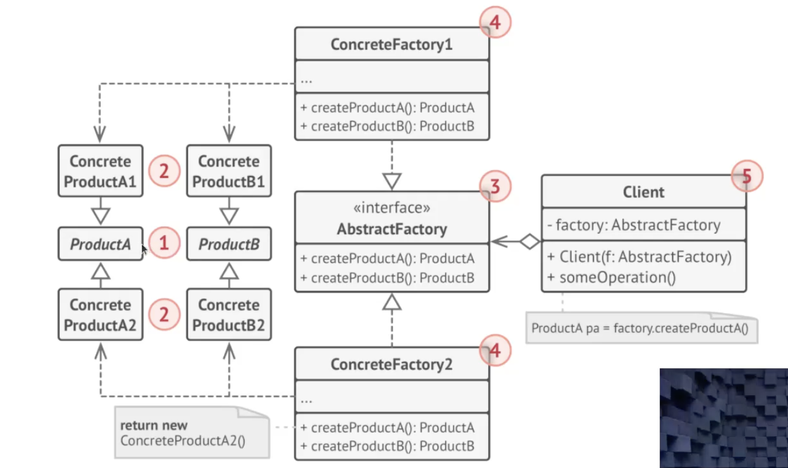

## Application

Use the Abstract Factory when your code needs to work with various families of related products, but you don't want it to depend on the concrete classes of those products—they might be unknown beforehand or you simply want to allow for future extensibility.

```php
namespace Src\AbstractFactory\FormBuilder\Elements;

interface Button
{
    public function render();
}
```

```php
namespace Src\AbstractFactory\FormBuilder\Elements;

interface TextInput
{
    public function render();
}
```

```php
namespace Src\AbstractFactory\FormBuilder\Elements;

interface TextArea
{
    public function render();
}
```

```php
namespace Src\AbstractFactory\FormBuilder\Elements;

interface RadioButton
{
    public function render();
}
```

```php
namespace Src\AbstractFactory\FormBuilder;

use Src\AbstractFactory\FormBuilder\Elements\Button;
use Src\AbstractFactory\FormBuilder\Elements\RadioButton;
use Src\AbstractFactory\FormBuilder\Elements\TextArea;
use Src\AbstractFactory\FormBuilder\Elements\TextInput;

interface FormUIFactory
{
    public function createButton(): Button;
    public function createTextInput(): TextInput;
    public function createTextArea(): TextArea;
    public function createRadioButton(): RadioButton;
}
```
```php
namespace Src\AbstractFactory\FormBuilder\Providers\Bootstrap\Elements;

use Src\AbstractFactory\FormBuilder\Elements\Button;

class BootstrapButton implements Button
{
    public function render()
    {
        echo '<button name="save-button" class="form-input">Button</button>';
    }
}
```

```php
namespace Src\AbstractFactory\FormBuilder\Providers\Bootstrap\Elements;

use Src\AbstractFactory\FormBuilder\Elements\TextArea;

class BootstrapTextArea implements TextArea
{
    public function render()
    {
        echo '<textarea class="form-input textarea" rows="10" cols="30">Text Area Content</textarea>';
    }
}
```

```php
namespace Src\AbstractFactory\FormBuilder\Providers\Bootstrap\Elements;

use Src\AbstractFactory\FormBuilder\Elements\RadioButton;

class BootstrapRadioButton implements RadioButton
{
    public function render()
    {
        // TODO: Implement render() method.
    }
}
```

```php
namespace Src\AbstractFactory\FormBuilder\Providers\Bootstrap\Elements;

use Src\AbstractFactory\FormBuilder\Elements\TextInput;

class BootstrapTextInput implements TextInput
{
    public function render()
    {
        // TODO: Implement render() method.
    }
}
```
### And the same for the rest of the forms ... 

```php
use Illuminate\Http\Request;

class FormBuilderController extends Controller
{
    private $formUiBuilder;

    /**
     * @param $formUiBuilder
     */
    public function __construct($formUiBuilder)
    {
        $this->formUiBuilder = $formUiBuilder;
    }

    public function output(Request $request)
    {
        $button = $this->formUiBuilder->createButton();
        $textInput = $this->formUiBuilder->createTextInput();
        $textArea = $this->formUiBuilder->createTextArea();

        return view('form', compact('button', 'textArea', 'textInput'));
    }
}
```

```php
public function register()
{
    $this->app->bind(abstract: FormUIFactory::class, concrete: BootstrapFormUiFactory::class);
}
```

# Builder 

Builder is a creational design pattern that lets you construct complex objects step by step. The pattern allows you to produce different types and representations of an object using the same construction code.

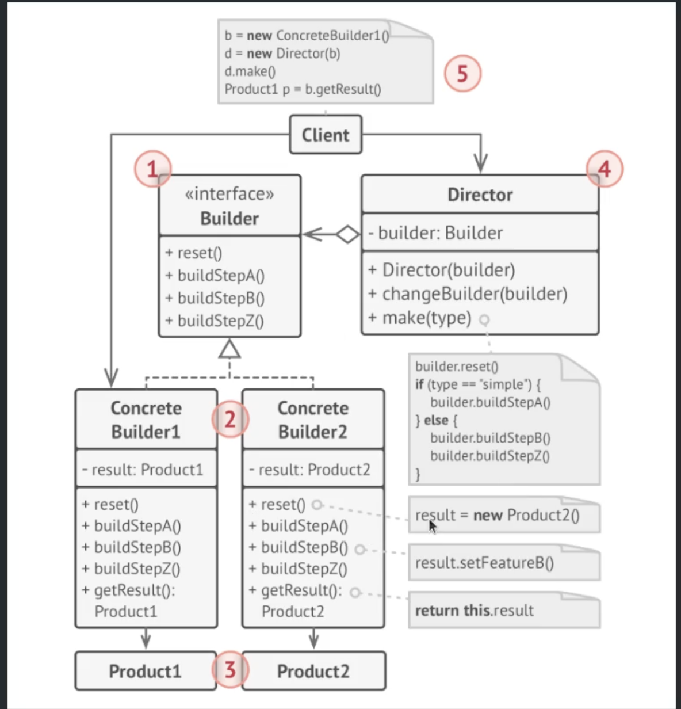

## Application

Use the Builder pattern to get rid of a "telescopic constructor".
Use the Builder pattern when you want your code to be able to create different representations of some product.   
Use the Builder to construct Composite trees or other complex objects.

```php
namespace Src\RequestBuilder;

class Request
{
    private $url;
    private $data;
    private $method;
    private $headers;
    private $agent;

    public function __construct(RequestBuilder $builder)
    {
        $this->uri = $builder->getUri();
        $this->method = $builder->getMethod();
        $this->data = $builder->getData();
        $this->headers = $builder->getHeaders();
        $this->agent = $builder->getAgent();
    }

    public function run()
    {
        $request = curl_init($this->uri);

        // ... rest of the implementation ...

        return null;
    }
}
```

```php
namespace Src\RequestBuilder;

class RequestBuilder
{
    private $uri;
    private $data;
    private $method;
    private $headers;
    private $agent;

    /**
     * @var Request
     */
    private $request;

    public static function forge(): RequestBuilder
    {
        return new RequestBuilder();
    }

    public function withUri(string $uri): RequestBuilder
    {
        $this->uri = $uri;
        return $this;
    }

    public function withData(array $data): RequestBuilder
    {
        $this->data = $data;

        return $this;
    }

    public function withHeaders(array $headers): RequestBuilder
    {
        $this->headers = $headers;

        return $this;
    }

    public function withAgent(string $agent): RequestBuilder
    {
        $this->agent = $agent;

        return $this;
    }

    public function withMethod(string $method): RequestBuilder
    {
        $this->method = $method;

        return $this;
    }

    public function getUri()
    {
        return $this->uri;
    }

    public function getData()
    {
        return $this->data;
    }

    public function getHeaders()
    {
        return $this->headers;
    }

    public function getAgents()
    {
        return $this->agents;
    }

    public function getMethod()
    {
        return $this->method;
    }

    public function build(): Request
    {
        return new Request($this);
    }


}
```

```php
namespace Src\RequestBuilder;

class ApiService
{
    public function fetchUsers()
    {
        $request = RequestBuilder::forge()
            ->withUri(uri: 'https://api-service.com/users')
            ->withMethod(method: 'GET')
            ->withData([
                'user_name' => 'some_user_name',
                'password' => 'some_password'
            ])
            ->build();

            $response = $request->run();
    }
}
```
# Adapter 

Adapter is a structural design pattern that allows objects with incompatible interfaces to collaborate.

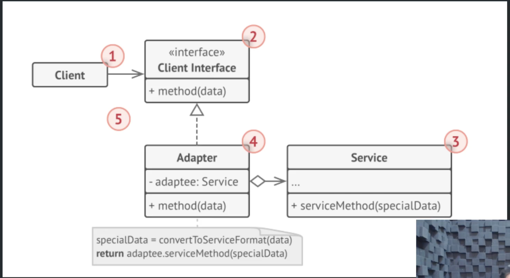

## Application

### Use the Adapter class when you want to use some existing class, but its interface isn't compatible with the rest of your code

### Use the pattern when you want to reuse several existing subclasses that lack some common functionality that can't be added to the superclass.

```php
namespace Src\PaymentProvider;

class Invoice
{
    private $amount;

    /**
     * @param $amount
     */
    public function __construct($amount)
    {
        $this->amount = $amount;
    }

    public function amount(): int
    {
        return $this->amount;
    }
}
```

```php
namespace Src\PaymentProvider;

interface OnlineGateway
{
    public function startPay(Invoice $invoice): void;
}
```

```php
namespace Src\PaymentProvider;

class ZarnipalProvider implements OnlineGateway
{
    public function startPay(Invoice $invoice): void
    {
        // TODO: Implement startPay() method.
    }
}
```
```php
namespace Src\PaymentProvider;

class SamanBankGateway
{
    private $apiKey;

    /**
     * @param $apiKey
     */
    public function __construct($apiKey)
    {
        $this->apiKey = $apiKey;
    }

    public function pay(int $amount): void
    {
        // ...
    }
}
```

```php 
namespace Src\PaymentProvider;

class SamanGatewayAdapter implements OnlineGateway
{
    private $samanApi;

    /**
     * @param SamanBankGateway $samanApi
     */
    public function __construct(SamanBankGateway $samanApi)
    {
        $this->samanApi = $samanApi;
    }

    public function startPay(Invoice $invoice): void
    {
        $this->samanApi->pay($invoice->amount());
    }
}
```

# Bridge 

Bridge is a structural design pattern that lets you split a large class or a set of closely related classes into two separate hierarchies—abstraction and implementation—which can be developed independently of each other.

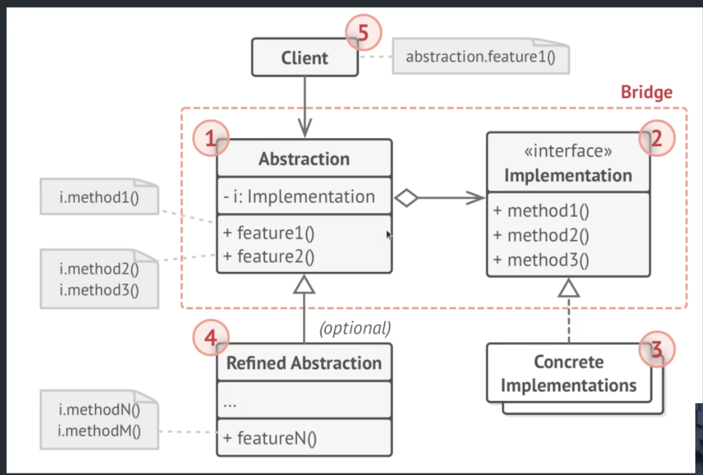

## Application

### Use the Bridge pattern when you want to divide and organize a monolithic class that has several variants of some functionality (for example, if the class can work with various database servers)

### Use the pattern when you need to extend a class in several orthogonal (independent) dimensions.

### Use the Bridge if you need to be able to switch implementations at runtime


```php
namespace Src\PaymentModule;

abstract class PaymentMethod
{
    private $handler;

    /**
     * @param PaymentHandler $handler
     */
    public function __construct(PaymentHandler $handler)
    {
        $this->handler = $handler;
    }

    abstract public function startPay(Invoice $invoice);
}
```

```php
namespace Src\PaymentModule;

interface PaymentHandler
{
    public function pay(Invoice $invoice);
}
```

```php

class OnlinePayment extends PaymentMethod
{
    private $connection;

    /**
     * @param Connection $connection
     */
    public function __construct(Connection $connection, PaymentHandler $handler)
    {
        parent::__construct($handler);
        $this->connection = $connection;
    }

    public function startPay(Invoice $invoice)
    {
        // $this->connection->insert("INSERT INTO payments");
        $this->handler->pay($invoice);
    }
}
```
```php
namespace Src\PaymentModule\Handlers;

use Src\PaymentModule\Invoice;
use Src\PaymentModule\PaymentHandler;

class SayyadChequeHandler implements PaymentHandler
{
    public function pay(Invoice $invoice)
    {
        // TODO: Implement pay() method.
    }
}
```

```php
public function register()
{
    $this->app->bind(OnlinePayment::class, function ($app) {
        $connection = resolve(ConnectionFactory::class);
        return new OnlinePayment($connection->make('mysql'), new SayyadChequeHandler());
    });
}
```
# Composite

Composite is a structural design pattern that lets you compose objects into tree structures and then work with these structures as if they were individual objects.

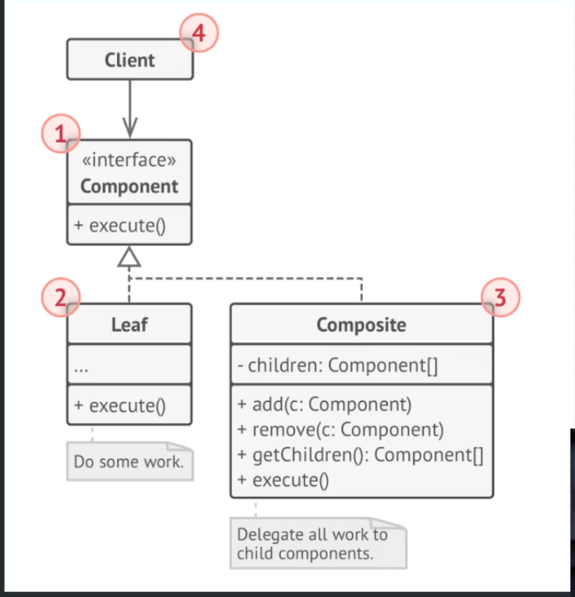

## Application

### Use the Composite pattern when you have to implement a tree-like object structure.

### Use the pattern when you want the client code to treat both simple and complex elements uniformly.

```php
namespace Src\Concept;

interface Component
{
    public function operation();
}
```

```php
namespace Src\Concept;

class Leaf implements Component
{
    public function operation()
    {
        // TODO: Implement operation() method.
    }
}
```

```php
namespace Src\Concept;

class Composite implements Component
{
    private $components = [];

    public function addComponent(Component $component)
    {
        $this->components[] = $component;
    }

    public function operation()
    {
        foreach ($this->components as $component) {
            $component->operation();
        }
    }
}
```

```php
namespace Src\Concept;

class Client
{
    private $component;

    /**
     * @param Component $component
     */
    public function __construct(Component $component)
    {
        $this->component = $component;
    }
}
```
# Decorator

Decorator is a structural design pattern that lets you attach new behaviors to objects by placing these objects inside special wrapper objects that contain the behaviors..

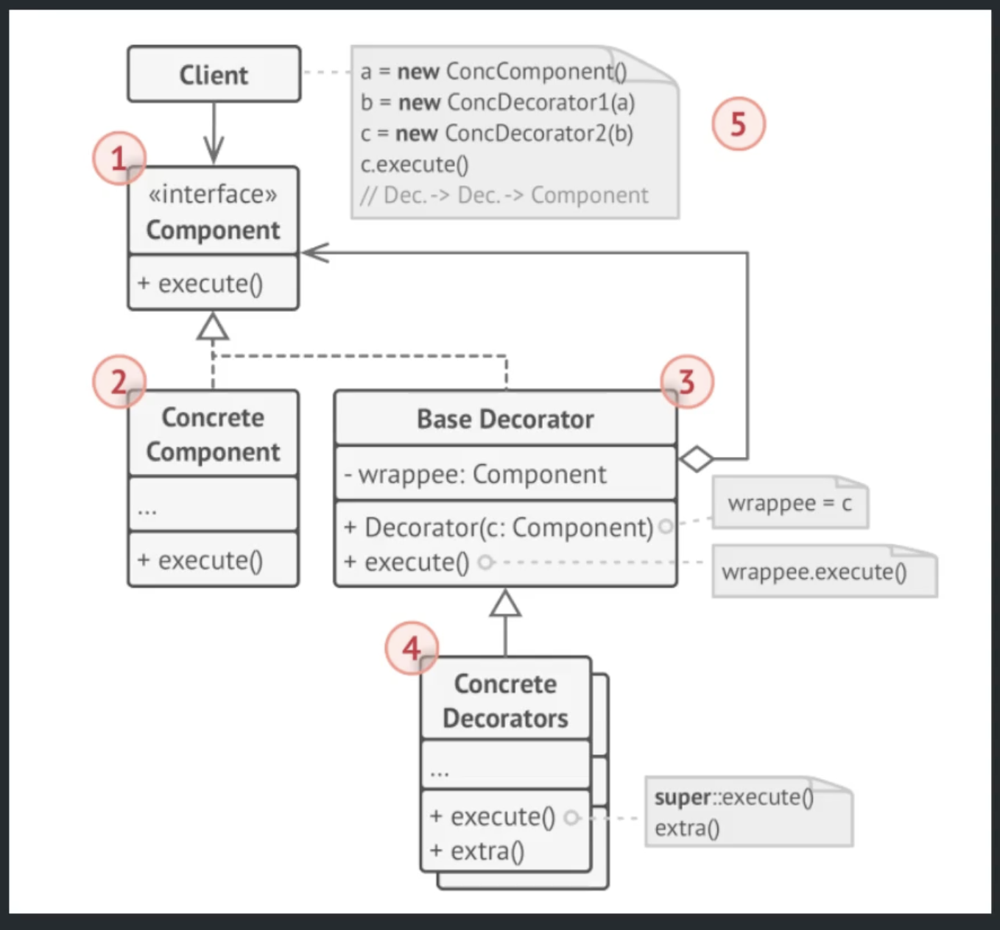

## Application

### Use the Decorator pattern when you need to be able to assign extra behaviors to objects at runtime without breaking the code that uses these objects.  

### Use the pattern when it's awkward or not possible to extend an object's behavior using inheritance

```php
namespace Src\InvoicePrice;

interface InvoicePrice {
    public function price(): int;
}
```
```php
namespace Src\InvoicePrice;

class Invoice implements InvoicePrice {
    public function price(): int {
        return 1000000;
    }
}
```

```php
namespace Src\InvoicePrice;

class InvoiceDecorator implements InvoicePrice {
    private $invoicePrice;

    /**
     * @param InvoicePrice $invoicePrice
     */
    public function __construct(InvoicePrice $invoicePrice) {
        $this->invoicePrice = $invoicePrice;
    }

    public function price(): int {
        return $this->invoicePrice->price();
    }
}
```

```php
namespace Src\InvoicePrice;

class VATInvoicePrice extends InvoiceDecorator {
    public function price(): int {
        return parent::price() - (parent::price() * 0.09);
    }
}
```
```php
namespace Src\InvoicePrice;

class ServiceInvoicePricePrice extends InvoicePriceDecorator {
    public function price(): int {
        return parent::price() + 35000;
    }
}

```

```php
namespace Src\InvoicePrice;

class InvoiceService {
    public function calculatePrice(): int {
        $invoice = new Invoice();
        $serviceInvoicePrice = new ServiceInvoicePricePrice($invoice);
        $vatInvoicePrice = new VATInvoicePricePrice($serviceInvoicePrice);
        return $vatInvoicePrice->price();
    }
}
```
# Facade

Facade is a structural design pattern that provides a simplified interface to a library, a framework, or any other complex set of classes.

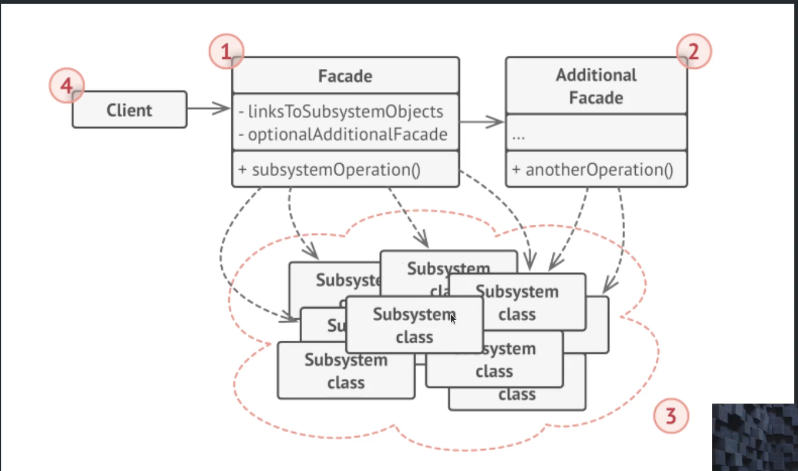

## Application

### Use the Facade pattern when you need to have a limited but straightforward interface to a complex subsystem.

### Use the Facade when you want to structure a subsystem into layers.

```php
namespace Src\OrderService;

class QuantityService {
    public function exist(Product $product): bool {
        return true;
    }
}
```
```php
namespace Src\OrderService;

class DiscountService {
    private function isValid(string $coupon): bool {
        return true;
    }

    public function apply(string $coupon): int {
        if (!$this->isValid($coupon)) {
            throw new RuntimeException(message: 'این کد تخفیف معتبر نمی باشد');
        }

        return 500000;
    }
}
```
```php
namespace Src\OrderService;

class OrderService {
    private $quantityService;
    private $discountService;

    public function __construct(QuantityService $quantityService, DiscountService $discountService) {
        $this->quantityService = $quantityService;
        $this->discountService = $discountService;
    }

    public function register(Basket $basket) {
        // check quantity
        foreach ($basket->items() as $product) {
            $result = $this->quantityService->exist($product);
        }

        // discount apply
        $amount = $this->discountService->apply($basket->coupon());

        // register order
        $order = Order::create(userId: 1, $amount, [], $basket->coupon());
    }
}
```

```php
namespace Src\OrderService;

class Basket {
    private $items;

    public function add(Product $product) {
        $this->items[] = $product;
    }

    public function coupon(): string {
        return '5645465987asda';
    }

    public function items() {
        return $this->items;
    }
}
```

# Flyweight

Flyweight is a structural design pattern that lets you fit more objects into the available amount of RAM by sharing common parts of state between multiple objects instead of keeping all of the data in each object.

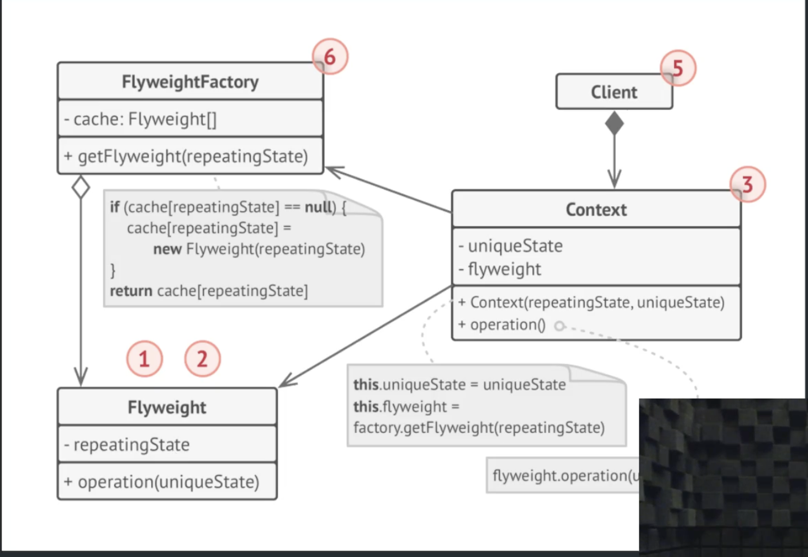

## Application

### Use the Flyweight pattern only when your program must support a huge number of objects which barely fit into available RAM.

```php
namespace Src\DiscountGenerator;

class Discount {
    private $code;
    private $userId = 0;
    private $constraints;

    public function __construct(string $code, int $userId, DiscountConstraints $constraints) {
        $this->code = $code;
        $this->userId = $userId;
        $this->constraints = $constraints;
    }
}
```

```php
namespace Src\DiscountGenerator;

class DiscountConstraints {
    private $expirationDate;
    private $limit;
    private $minAmount = 0;
    private $maxAmount;
    private $percent;

    public function __construct($expirationDate, $limit, int $minAmount, $maxAmount, $percent) {
    $this->expirationDate = $expirationDate;
    $this->limit = $limit;
    $this->minAmount = $minAmount;
    $this->maxAmount = $maxAmount;
    $this->percent = $percent;
}
}
```

```php
namespace Src\DiscountGenerator;

class DiscountFactory {
    private $constraints = [];
    private $discounts = [];
    public function createDiscount(
        string $code,
        int $userId,
        \DateTimeImmutable $expirationDate,
        int $limit,
        int $minAmount,
        int $maxAmount,
        int $percent
    ):Discount {
        $constraint = $this->createConstraint($expirationDate, $limit, $minAmount, $maxAmount, $percent);

        $discount = new Discount($code, $userId, $constraint);
        $this->discounts[] = $discount;

        return $discount;
    }

    private function createConstraint(\DateTimeImmutable $expirationDate, int $limit, int $minAmount, int $maxAmount, int $percent): DiscountConstraints {
    $key = $this->createKey(get_defined_vars());

    if (!isset($this->constraints[$key])) {
        $this->constraints[$key] = new DiscountConstraints($expirationDate, $limit, $minAmount, $maxAmount, $percent);
    }

        return $this->constraints[$key];
    }

    private function createKey(array $data): string {
        ksort($data);

        return md5(implode(separator: '', $data));
    }
}
```

```php
namespace Src\DiscountGenerator;

class Client {
    private $discountFactory;
    public function __construct(DiscountFactory $discountFactory) {
        $this->discountFactory = $discountFactory;
    }

    public function createDiscounts() {

        foreach (range(start: 1, end: 100000) as $counter) {
            $dateRange = mt_rand(1, 5);
            $limitRange = mt_rand(1, 3);

            $minRange = [0, 10000, 20000];
            $maxRange = [100000, 200000, 500000];

            $percentRange = mt_rand(15, 35);

            $this->discountFactory->createDiscount(
                Str::random(length: 10),
                userId: 0,
                \DateTimeImmutable::createFromMutable(new DateTime(datetime: "+ {$dateRange} day")),
                $limitRange,
                array_rand($minRange),
                array_rand($maxRange),
                $percentRange
            );
        }
    }
}
```
# Proxy

Proxy is a structural design pattern that lets you provide a substitute or placeholder for another object. A proxy controls access to the original object, allowing you to perform something either before or after the request gets through to the original object.

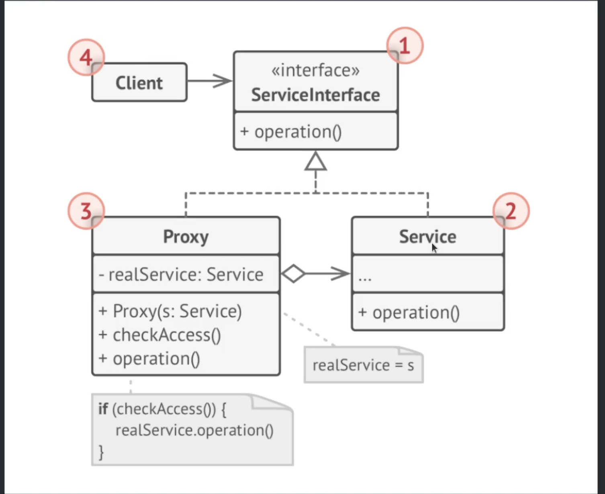

## Application

### Lazy initialization (virtual proxy): This is when you have a heavyweight service object that wastes system resources by being always up, even though you only need it from time to time.  

### Caching request results (caching proxy): This is when you need to cache results of client requests and manage the life cycle of this cache, especially if results are quite large.

```php
<?php

namespace Src\CachedRepository;

interface ProductRepositoryInterface {
    public function all();
}
```

```php
namespace Src\CachedRepository;

class EloquentProductRepository implements ProductRepositoryInterface {
    public function all() {
        // TODO: Implement all() method.
    }
}
```

```php
namespace Src\CachedRepository;

class CachedProductRepository implements ProductRepositoryInterface {
    private $productRepository;
    private $cache;

    public function __construct(ProductRepositoryInterface $eloquentProductRepository, Repository $cache) {
        $this->productRepository = $eloquentProductRepository;
        $this->cache = $cache;
    }

    public function all() {
        $result = $this->cache->get(key: 'products.all');

        if (is_null($result)) {
            $result = $this->productRepository->all();
            $this->cache->set(key: 'products.all', $result);
        }

        return $result;
    }
}
```

# Chain of Responsibility

Chain of Responsibility is a behavioral design pattern that lets you pass requests along a chain of handlers. Upon receiving a request, each handler decides either to process the request or to pass it to the next handler in the chain.

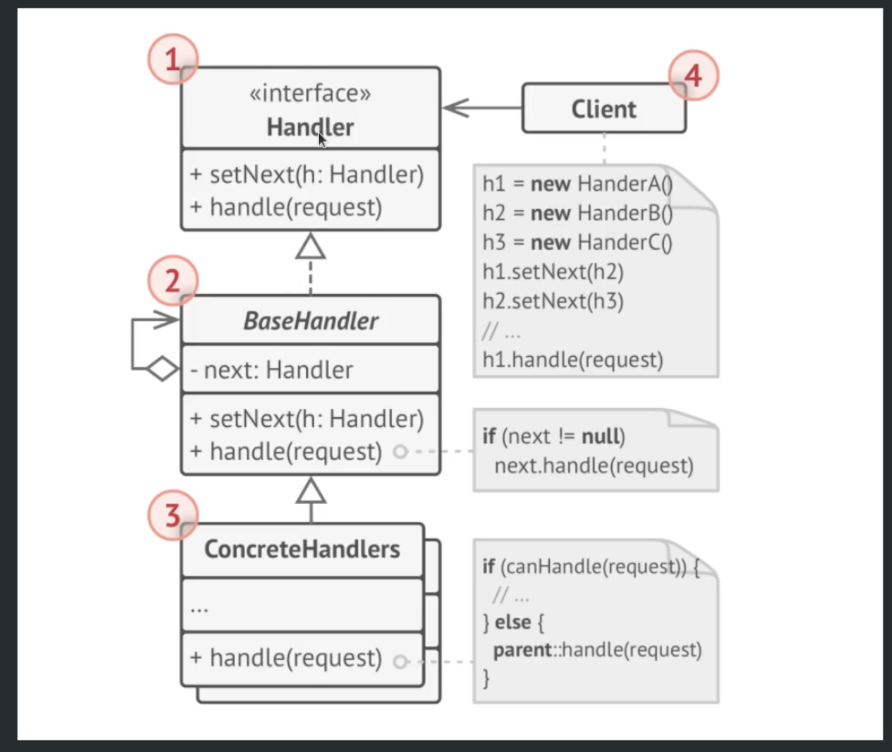

## Application

### Use the Chain of Responsibility pattern when your program is expected to process different kinds of requests in various ways, but the exact types of requests and their sequences are unknown beforehand.   
### Use the pattern when it's essential to execute several handlers in a particular order.

### Use the CoR pattern when the set of handlers and their order are supposed to change at runtime.

```php
namespace Src\RegistrationService;

final class RegistrationRequest {
    private $emailAddress;
    private $password;
    private $referralCode;

    public function __construct($emailAddress, $password, $referralCode) {
        $this->emailAddress = $emailAddress;
        $this->password = $password;
        $this->referralCode = $referralCode;
    }

    //getters

}
```

```php
namespace Src\RegistrationService;

abstract class Checker {
    private $nextChecker;
    public function __construct(Checker $nextChecker = null) {
        $this->nextChecker = $nextChecker;
    }

    public function check(RegistrationRequest $request):bool {
        if (!$this->nextChecker) {
            return true;
        }

        return $this->nextChecker->check($request);
    }
}
```

```php
class UserEmailChecker extends Checker {
    public function check(RegistrationRequest $request):bool {
        if ($this->emailExists($request->getEmailAddress())) {
            return false;
        }

        return parent::check($request); 
    }

    private function emailExists(string $emailAddress): bool {
        return User::query()->where(column: 'email', $emailAddress)->count() > 0;
    }
}
```

```php
class UserPasswordChecker extends Checker {
    public function check(RegistrationRequest $request): bool {
        if (!$this->isPasswordValid($request->getPassword())) {
            return false;
        }

        return parent::check($request);
    }

    private function isPasswordValid(string $password): bool {
        return true;
    }
}
```

```php
class ReferralChecker extends Checker {
    public function check(RegistrationRequest $request): bool {
        if (!$this->isReferralValid($request->getReferralCode())) {
            return false;
        }

        return parent::check($request);
    }

    private function isReferralValid(string $referral): bool {
        return Referral::query()->where(column: 'code', $referral)->count() > 0;
    }
}
```

```php
class RegistrationService {
    public function register(RegistrationRequest $request) {
        return $this->checkerChain()->check($request);
    }

    private function checkerChain(): Checker {
        $referralChecker = new ReferralChecker();
        $passwordChecker = new UserPasswordChecker($referralChecker);
        return new UserEmailChecker($passwordChecker);
    }
}
```
# Strategy

Strategy is a behavioral design pattern that lets you define a family of algorithms, put each of them into a separate class, and make their objects interchangeable.


## Application

### Use the Strategy pattern when you want to use different variants of an algorithm within an object and be able to switch from one algorithm to another during runtime.   

### Use the Strategy when you have a lot of similar classes that only differ in the way they execute some behavior.   

### Use the pattern to isolate the business logic of a class from the implementation details of algorithms that may not be as important in the context of that logic.

```php
namespace Src\Payment;

interface PaymentMethod {
    public function doPayment(Order $order);
}
```

```php
namespace Src\Payment;

class PaymentService {
    /** @var PaymentMethod */
    private $paymentMethod;

    public function setPaymentMethod(PaymentMethod $method) {
        $this->paymentMethod = $method;
    }

    public function pay(Order $order) {
        $this->paymentMethod->doPayment($order);
    }
}
```

```php
namespace Src\Payment;

class CashPayment implements PaymentMethod {
    public function doPayment(Order $order) {
        // TODO: Implement doPayment() method.
    }
}
```

```php
namespace Src\Payment;

class ChequePayment implements PaymentMethod {
    public function doPayment(Order $order) {
        // TODO: Implement doPayment() method.
    }
}
```

```php
class PaymentsController extends Controller {
    public function startPayment(Request $request) {
        $order = new Order(price: 1250000);
        $paymentService = new PaymentService();
        $paymentService->setPaymentMethod($this->makePaymentMethod($request->get('payment_method')));
        $paymentService->pay($order);
    }

    private function makePaymentMethod(string $method) {
    switch ($method) {
        case 'cash':
            return new CashPayment();
            break;
        case 'online':
            return new OnlinePayment();
            break;
        case 'cheque':
            return new ChequePayment();
            break;
        default:
            throw new RuntimeException(message: 'روش پرداخت معتبر نمی باشد');
            break;
    }
    }
}
```


